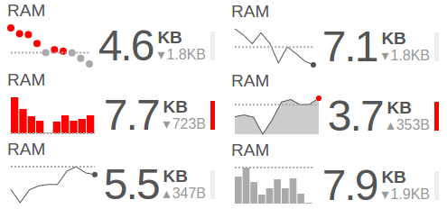

#QuickVis
QuickVis is a graphing library with the goal of visualizing data in a way that is fast and easy to read. The visualizations are minimally interactive, not pan or zoomable, and do not refresh themselves. You put some data in and you get a visualization. END!



## Development
To develop this project you will need `node` and `npm` installed. Once that's all squared away, install some npm packages

```
# global packages
npm install -g gulp

#local dependencies
npm install
```

Now you can use `gulp` to do things

```
# generate the distributable js lib
gulp dist

# bring up the demo page with livereload for active development
gulp watch

# run unit tests
gulp test

# continuously run unit tests for active development
gulp tdd

# generate the distributable js lib, run tests, [TODO] bump version.
# use this when `git-flow release`ing
gulp release

```

If you don't have nodejs :( but you *do* have docker installed, you're in luck! You can do a few things via `make`

```
# build the distributable js lib
make build

# run unit tests
make test
```

## Development Best Practices

The pieces at play here are the usual supects: **Model**, **View**, and **ViewModel**. **Model** is whatever data is passed by the user into the `update()` function, and should be treated as immutable. **View** is the HTML template that is eventually passed into the DOM. The **ViewModel** is the instance of the visualization (eg: Sparkline or StackedBar), and contains the model as well as template helper methods for getting human-readable info from the model. In this way, the ViewModel binds the View together with the Model.

In order to keep things as reasonable as one can expect in the wild west of webdev, there are some best practices that should be followed when creating new visualizations or modifying existing ones. Take a look at `src/Sparkline.js` for lots of comments about the module's structure.

* Only touch the DOM in the `_render()` method or draw helper methods, but no where else! The DOM is dangerous and scary and should be hidden far far away. However, to keep `_render()` from getting to unwieldy, you can create draw helpers to do specific things like `drawLine()`. It's ok to access the DOM inside helpers as well, but treat the DOM like some sort of terrifying mystical creature that you don't really understand because it basically is.

* Keep templates as logic-less as possible. If you want to do any logic, write a helper method. Template helper methods have the task of taking obtuse model data, like `1467038751`, and turning it into something a human can use, such as "Mon, 27 Jun 2016 14:45:51 GMT". Prefer tiny little helpers that do one little thing and compose them together to take imcomprehensible model data and turn it into useful visualization.

* Don't modify the model. If you need to generate something new from the model data (like taking the average of an array of numbers), do it inside the `_update()` method, and attach the newly generated info to the viewmodel (aka `this`). If the new data is purely for presentation (like converting a timestamp to date), then it belongs in a template helper, not on the viewmodel.
